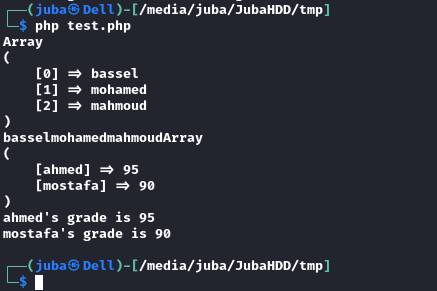
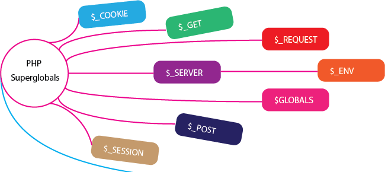

# Table Of Contents 
- [# PHP	Basics](#basics)
  - [Basics Syntax](#basics-syntax)
    - [<mark style="background: #CACFD9A6;">// Comment</mark> or <mark style="background: #CACFD9A6;"># Comment</mark>](#comment)
    - [Array](#array)
      - [1-Indexed Array](#1-indexed-array)
        - [`$array_name = array(value, value, ..);`](#array_name--arrayvalue-value-)
      - [2-Associative Array](#2-associative-array)
        - [`$array_name = array('key' ⇒ 'value'); echo $array_name['key'];` like the dictionary in python](#array_name--arraykey--value-echo-array_namekey-like-the-dictionary-in-python)
      - [3-Multidimensional arrays](#3-multidimensional-arrays)
  - [##### `$arr = array(array('bla', 'bla', 'bla'));` 2D array](#-arr--arrayarraybla-bla-bla-2d-array)
    - [Print all the array](#print-all-the-array)
      - [1- `printr(array)`](#1--printrarray)
      - [2- `foreach()`](#2--foreach)
        - [2.1- `foreach(Indexed_array)`](#21--foreachindexed_array)
          - [`foreach ($names as $name){echo $name;}`](#foreach-names-as-nameecho-name)
        - [2.2- `foreach(associative_array)`](#22--foreachassociative_array)
          - [`foreach($students_and_grades as $student_name => $student_grade){echo "what you want!";}`](#foreachstudents_and_grades-as-student_name--student_gradeecho-what-you-want)
    - [No value](#no-value)
  - [#### `$name= NULL;`](#-name-null)
    - [Constant](#constant)
      - [`define(const, value);](#defineconst-value)
  - [#### `define('PI',3.14;)`](#-definepi314)
    - [combine strings with `.` (concatenation)](#combine-strings-with--concatenation)
  - [#### `echo "Hi, " . $name;`](#-echo-hi---name)
    - [pass data using forms](#pass-data-using-forms)
      - [`$_GET` is a get  reserved variable Get pass through the URL](#_get-is-a-get--reserved-variable-get-pass-through-the-url)
  - [#### `$_POST` pass through the Protocol body, payload](#-_post-pass-through-the-protocol-body-payload)
    - [Superglobals : reserved variables](#superglobals--reserved-variables)
      - [**`$GLOBALS`**  → `$GLOBALS['$_POST', '$_GET']`;](#globals---globals_post-_get)
      - [**`$_POST `** or `$GLOBALS['_POST']`](#_post--or-globals_post)
      - [**`$_GET `** or `$GLOBALS['_GET']`](#_get--or-globals_get)
      - [**`$_COOKIE `** or  `$GLOBALS['_COOKIE']`](#_cookie--or--globals_cookie)
      - [**`$_SESSION`** or  `$GLOBALS['_SESSION']`](#_session-or--globals_session)
      - [**`$_SERVER`** or  `$GLOBALS['_SERVER']`](#_server-or--globals_server)
      - [**`$_FILES`** or  `$GLOBALS['_FILES']`](#_files-or--globals_files)
      - [**`$_REQUEST`** or  `$GLOBALS['_REQUEST']`](#_request-or--globals_request)
      - [**`$_ENV`** or  `$GLOBALS['_ENV']`](#_env-or--globals_env)
    - [Math Operations](#math-operations)
  - [#### `echo (math_operation);` without any additional symbols](#-echo-math_operation-without-any-additional-symbols)
    - [Comparison operators](#comparison-operators)
      - [`==` Equal](#-equal)
      - [`===` identical (equal and the same Data Type)](#-identical-equal-and-the-same-data-type)
      - [`!=` Not equal or `<>`](#-not-equal-or-)
      - [`!==` Not identical](#-not-identical)
      - [`a <=> b` spaceship](#a--b-spaceship)
    - [Logical Operators](#logical-operators)
      - [`and` , `&&`  ⇒ AND](#and-----and)
      - [`or` , `||`        ⇒ OR](#or-----------or)
      - [`!`              ⇒ NOT](#---------------not)
  - [#### `xor`         ⇒ XOR](#-xor----------xor)
    - [If condition](#if-condition)
      - [1-Normal if](#1-normal-if)
      - [2-`if-endif`](#2-if-endif)
      - [3-inline-if](#3-inline-if)
  - [##### `$variable = (condition) ? "value" : "another value" ;`](#-variable--condition--value--another-value-)
    - [the for loop is similar to C and C++](#the-for-loop-is-similar-to-c-and-c)
      - [`for ($num = 0; $num < 100 ; $num++){echo $num}`](#for-num--0-num--100--numecho-num)
      - [`for-endfor`](#for-endfor)
    - [While loop is similar to C and C++](#while-loop-is-similar-to-c-and-c)
  - [#### `while ($i > 100){echo $i; $i--;}`](#-while-i--100echo-i-i--)
    - [do-while is similar to C and C++, don't forget the ; after the while](#do-while-is-similar-to-c-and-c-dont-forget-the--after-the-while)
    - [Functions](#functions)
      - [basic syntax:](#basic-syntax)
  - [#####  `function func_name($param1, param2=5)` // param2 has default value 5](#--function-func_nameparam1-param25--param2-has-default-value-5)
      - [Value parameter and Reference parameter](#value-parameter-and-reference-parameter)
      - [Reference parameter](#reference-parameter)
      - [variable number of parameters](#variable-number-of-parameters)
      - [return multiple values](#return-multiple-values)
      - [double list](#double-list)
    - [exception handling](#exception-handling)
    - [PHP scripts inside HTML page](#php-scripts-inside-html-page)
    - [`$bool = true;` neither True nor TRUE](#bool--true-neither-true-nor-true)
    - [Working with files #PHP_important](#working-with-files-php_important)
    - [Concatenation assignment](#concatenation-assignment)
    - [Strings](#strings)
      - [convert a string to array with spaces](#convert-a-string-to-array-with-spaces)
  - [- Hint : you can type `echo "it is $variable";` or concatenation using **`.`** (you can't do it inside single quotes)](#--hint--you-can-type-echo-it-is-variable-or-concatenation-using--you-cant-do-it-inside-single-quotes)
    - [HTML special chars #PHP_security](#html-special-chars-php_security)
    - [Redirection #PHP_important](#redirection-php_important)
    - [Including Files #PHP_important #PHP_security #PHP_LFI](#including-files-php_important-php_security-php_lfi)
- [Woohoo You have finished 😃](#woohoo-you-have-finished-)
- [flag{PHP_N1N94_H4CK3R} 💪](#flagphp_n1n94_h4ck3r-)
----
----
# Tags 
## #PHP_important
## #PHP_security
## #PHP_basics_end
## #PHP_LFI 
---
---
# PHP	Basics <a name='basics'></a>
---
## Basics Syntax<a name='basics-syntax'></a>
### <mark style="background: #CACFD9A6;">// Comment</mark> or <mark style="background: #CACFD9A6;"># Comment</mark>  <a name='comment'></a>
### Array
#### 1-Indexed Array 
##### `$array_name = array(value, value, ..);`

#### 2-Associative Array
##### `$array_name = array('key' ⇒ 'value'); echo $array_name['key'];` like the dictionary in python

#### 3-Multidimensional arrays
##### `$arr = array(array('bla', 'bla', 'bla'));` 2D array 
---
---
### Print all the array 
#### 1- `printr(array)`
#### 2- `foreach()`
##### 2.1- `foreach(Indexed_array)`
###### `foreach ($names as $name){echo $name;}`
##### 2.2- `foreach(associative_array)`
###### `foreach($students_and_grades as $student_name => $student_grade){echo "what you want!";}`

- Example

```php

// printing Indexed array print_r() and foreach()

$names = array('bassel', 'mohamed', 'mahmoud'); // Don't forget the $ before names

	// First Method using print_r() built-in function (stands for Print human-Readable)
print_r($names); // Don't forget the semi colon ;
  
	// Second Method using foreach() - like (for name in names) in python
foreach($names as $name){

	echo $name;

}

# -----------------------------------

// printing assiciative array print_r() and foreach()
$students_and_grades = array('ahmed' => '95', 'mostafa' => '90');

	// First Method using print_r() built-in function (stands for Print Array)
print_r($students_and_grades);

	// Second Method using foreach() - like (for name in names) in python
foreach($students_and_grades as $student_name => $student_grade){

	echo "$student_name's grade is $student_grade \n";
}

```



---
---
### No value 
#### `$name= NULL;`
---
---
### Constant
#### `define(const, value);
#### `define('PI',3.14;)`
---
---
### combine strings with `.` (concatenation)
#### `echo "Hi, " . $name;`
---
---
### pass data using forms 
#### `$_GET` is a get  reserved variable Get pass through the URL 
#### `$_POST` pass through the Protocol body, payload 
---
---
### Superglobals : reserved variables 

#### **`$GLOBALS`**  → `$GLOBALS['$_POST', '$_GET']`;

#### **`$_POST `** or `$GLOBALS['_POST']`

####  **`$_GET `** or `$GLOBALS['_GET']`

#### **`$_COOKIE `** or  `$GLOBALS['_COOKIE']`

#### **`$_SESSION`** or  `$GLOBALS['_SESSION']`

#### **`$_SERVER`** or  `$GLOBALS['_SERVER']`

#### **`$_FILES`** or  `$GLOBALS['_FILES']`

#### **`$_REQUEST`** or  `$GLOBALS['_REQUEST']`

#### **`$_ENV`** or  `$GLOBALS['_ENV']`



```php
print_r($GLOBALS); // to print all the Globals 
```
---
---
### Math Operations 
#### `echo (math_operation);` without any additional symbols 
---
---
### Comparison operators
#### `==` Equal
#### `===` identical (equal and the same Data Type)
#### `!=` Not equal or `<>`
#### `!==` Not identical
#### `a <=> b` spaceship
```php
	//Comparing Integers

    echo 1 <=> 1; //output  0
    echo 3 <=> 4; //output -1
    echo 4 <=> 3; //output  1

    //String Comparison

    echo "x" <=> "x"; //output  0
    echo "x" <=> "y"; //output -1
    echo "y" <=> "x"; //output  1
```
---
---
### Logical Operators
#### `and` , `&&`  ⇒ AND
#### `or` , `||`        ⇒ OR
#### `!`              ⇒ NOT
#### `xor`         ⇒ XOR
---
---
### If condition
#### 1-Normal if 
```php
<?php  
$t = date("H");  
  
if ($t < "20") {  
  echo "Have a good day!";  
} else {  
  echo "Have a good night!";  
}  
?>
```
#### 2-`if-endif` 
```php
if(condition): do ;
and this .....;
elseif:...
else:...
endif ;
```
#### 3-inline-if
##### `$variable = (condition) ? "value" : "another value" ;`
---
---
### the for loop is similar to C and C++
#### `for ($num = 0; $num < 100 ; $num++){echo $num}`
#### `for-endfor`
```php
<?php  
for($i = 0; $i < 10; $i += 2):  
  echo "$i <br>";  
endfor;  
?>
```
---
----
### While loop is similar to C and C++
#### `while ($i > 100){echo $i; $i--;}`
---
----
### do-while is similar to C and C++, don't forget the ; after the while
```php
<?php  
$x = 6;  
do {  
  echo "The number is: $x <br>";  
  $x++;  
} while ($x <= 5);  
?>
```
---
---
### Functions
#### basic syntax: 
#####  `function func_name($param1, param2=5)` // param2 has default value 5
---
#### Value parameter and Reference parameter 
```php
function changeMe($change)
{
	$change=10;
}
$change = 5;
changeMe($change);
echo $change; //  The output : 5  because it is a value parameter not a reference parameter 

```
---
#### Reference parameter
```php
$OutTheFunction;
function changeMe(&$change)//it's a reference parameter 
{
	$change=10;

	global $OutTheFunction
}
$change = 5;
changeMe($change);
echo $change;//the output : 10

```
---
#### variable number of parameters

```php
function getMe(...nums)//it will allow any value you put as a parameter and store it as an array
{}
getMe(1, 2, 34);
```
---
#### return multiple values
```php
function doMath($x, $y)
{
	return array($x + $y, kdsf, dksfds);
}
list ($sum, $ksd) = doMath(1, 2);
```
---
#### double list
```php
function doubleMe($x)
{
	return x * 2;
}
$list = [1, 2, 3, 4];
$double_list = array_map('doubleMe', $list);//array_map(function name, input source)
print_r($double_list);//print human readable
##The array_map() function sends each value of an array to a user-made function, and returns an array with new values, given by the user-made function. Tip: You can assign one array to the function, or as many as you like
```
---
---
### exception handling
```php 
//create function with an exception  
function checkNum($number) {  
  if($number > 1) {  
    throw new Exception("Value must be 1 or below");  
  }  
  return true;  
}  
  
//trigger exception in a "try" block  
try {  
  checkNum(2);  
  //If the exception is thrown, this text will not be shown  
  echo 'If you see this, the number is 1 or below';  
}  
  
//catch exception  
catch(Exception $e) {  
  echo 'Message: ' .$e -> getMessage();  
}  

```
---
---
### PHP scripts inside HTML page
```html
<? "This is a text printed with a short echo  you can use it in HTML not in PHP script "?>
<? "you can use 'single quotes ' in double quotes, or I can reverse it "?>
<? " you can use \" backslash with double quotes to put double quotes in double quotes\"?>
```

- Hint: it didn't work with me
 
---
---

### `$bool = true;` neither True nor TRUE 

---
---
### Working with files #PHP_important 
```php
<?php
	$fp = fopen('jar.txt', 'a'/*append*/); // fopen(FileName, Mode)
	
	fwrite($fp, $ip.' '.$browser."\n");//fwrite(file, string)
	fwrite($fp, urldecode($_SERVER['QUERY_STRING']). "\n\n");
	fclose($fp);
?>
```

```php
<?php  
$file = fopen("test.txt","r");  
fread($file,"10");  
fclose($file);  
?>
```

---
---
### Concatenation assignment
```php
$text = "This is a ";
$text .="text " ; 
echo $text ;` This is a text
```
---
---
### Strings
#### convert a string to array with spaces
```php
$let_str = "a b c d " ;
$let_arr = explode(' ', $let_str); // convert string to array 
foreach($let_arr as $l){
	printf("letter: %s<br>", $l); # print each value in the array 
}
$let_str_2 = implode(' ', $let_arr); // convert array to string
echo "string : $let_str_2<br>";
```

```php
printf("%placeholder", variable_name);
printf(strlen(string)); # string length
printf(ltrim(string)); # will trim the white spaces on the left
rtrim, trim
variable = trim(variable);
printf(strtoupper(string));
printf(strtolower(string));
printf(ucfirst(string)); # uppercase first chracter -> convert the first character to uppercase 
printf(substr(string, start, end)); // grap the first th characters 
printf(strcmp("string", "string")); # string compare 
printf(strpos(variable, "search for ..")); #string position 
printf(str_replace("string1", "string2", variable)); # string replace 
```

- Hint : you can type `echo "it is $variable";` or concatenation using **`.`** (you can't do it inside single quotes)
---
---
#PHP_basics_end 

---
---
---
### HTML special chars #PHP_security
```php
  

<?php

$html = "<a href='#'>sample</a> <br>";
echo $html; // XSS vulnerable
echo htmlspecialchars($html); // not vulnerable (you can't) XSS Mitigation
echo strip_tags($html), "<a>"; // removes <a>

?>
```
---
---
### Redirection #PHP_important
```php
header('Location: /php-crash/extras/dashboard.php');
```
---
---
### Including Files #PHP_important #PHP_security #PHP_LFI
- You should filter any included files to avoid LFI(Local File Inclusion) Vulnerability
```php
include 'file'; or include (""); # with () include('FileName in the same dir or PATH/FileName')
include_once "FileName ";
require "file"; or require ('file');# if file doesn't exist include will work with an Alert and require won't work 
```
---
---
---
# Woohoo You have finished 😃
# flag{PHP_N1N94_H4CK3R} 💪- [Tags <a name ='tags'></a>](#tags-)
